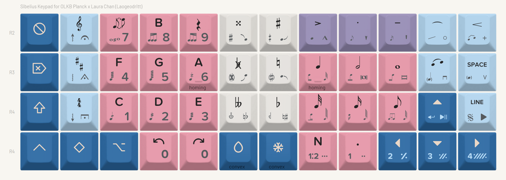

# Planck layout for Sibelius 7.5

A special-purpose layout for the Planck keyboard by [Laogeodritt](https://github.com/laogeodritt). This keyboard layout is designed for use with Sibelius 7.5, a music notation application, in order to allow faster entry of of music notation and reducing hand movement across the keyboard.

This layout is intended to be used *in addition to* a QWERTY keyboard, for text entry and the use of non-music-entry keyboard shortcuts (e.g. editing, reviewing or playback settings), along with a mouse for navigation. Because this layout is designed to fully replace the Sibelius numpad, you can use it alongside a TKL or smaller keyboard, or a laptop keyboard without numpad. *Why yes, I am giving you an excuse to take a spare keyboard out of your display case!*

I am unsure if all macros are compatible with Sibelius 8 and newer. If any users of current versions try this keyboard layout out, please let me know and/or feel free to contribute back any  changes you make!

# Motivation and design philosophy

Sibelius uses the numpad for the majority of its notation entry: it allows the selection of note durations (quarter notes/crotchet, eighth notes/quavers, etc.), stem types, note variations like cues, and various articulations and other symbols. This numpad uses multiple layers, using F7-F12 to toggle these layers. In addition, the letters A-G are used for pitch entry, and various keyboard shortcuts (single key, or with modifiers) are used to input other notations such as clef/key signature/time signature changes, hairpins, or expression text. Because of the variety of keyboard shortcuts across the alphanumeric keyboard, as well as the F-key layer toggles, one's hands find themselves travelling across the entire keyboard quite frequently.

This keyboard layout is designed to allow the user to input music notation more quickly, first by laying out the Sibelius numpad in a more logical and accessible way, secondly by reducing the number of layers and making layer swap more accessible, and finally by adding common non-numpad keyboard shortcuts to reduce how often the user needs to reach for the QWERTY keyboard. While designed for both hands on keyboard, it is equally possible to use it for step-time entry alongside a MIDI keyboard, with your non-piano hand on the right hand side of the Planck keyboard.

Because it is intended for use with a QWERTY keyboard, this layout intentionally does *not* include typing layers.

# Layer overview

Layers are represented with the primary layer at the top, the note alteration layer (water droplet key) in the bottom-left, and the articulations/symbols layer (snowflake key) in the bottom-right. These positions correspond to the position of the layer switch keys.

Holding down the water droplet or snowflake keys allow switching layers. There is no defined layer for holding both keys down.

Colours represent the different key groupings. These key groupings apply to all layers (with some minor exceptions), making navigation and memorisation of the layout's three layers relatively simple.

[TODO: overview the key groupings/locations]

# Keycaps

I designed and ordered a custom keycap set from Yuzu Keycaps, available here in case you would like to order or customise a set for yourself: https://yuzukeycaps.com/c/a0ad8803-30a6-43bf-9851-0be0b7250db8

This layout makes use of the [Leland Music Font](https://github.com/MuseScoreFonts/Leland) for music symbols, ProximaNovaSoft Semibold for alphanumeric glyphs, and Yuzu and Phosphor Icons for miscellaneous other symbols.

Note that these keycaps are dye-sub only, so they cannot provide LED shine-through.

Disclaimer: I am not affiliated with Yuzu Keycaps, and this section is not intended as an endorsement of the company or its services. I am providing this link for convenience only.
